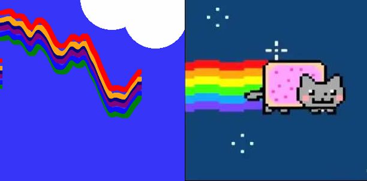
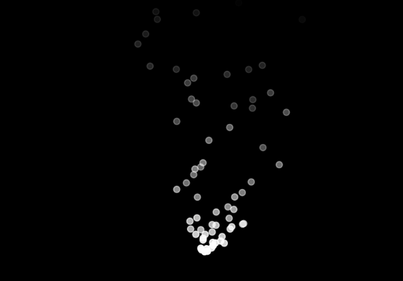
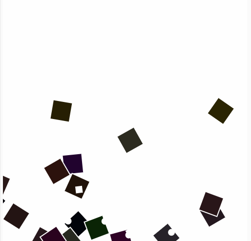

## ★정수진★
 * 디지털아트전공 인터랙티브아트 1623001
 * 저희 집 강아지 소이는 귀엽습니다 굉장히 매우 많이 very
----------------------

---------

## 작업
--------
* [3개의 표현 작업 1]
### [작업링크](https://editor.p5js.org/dkfjqthdl@gmail.com/embed/MrvBdFZbh)

 * 노이즈 값을 넣어 반복되는 무늬/마우스 값에 따라 배경의 스케일이 달라진다.
----
* [3개의 표현 작업 2]
### [작업링크](https://editor.p5js.org/dkfjqthdl@gmail.com/embed/HtX2NU5KX)

 * 왼쪽이 작업한 이미지 오른쪽은 만들고 싶었던 이미지입니다
 * 랜덤워크를 사용하였고 인생은 생각보다 호락호락하지 않았습니다...

 ##기말작업
 -------
 * [1.누르면 나오는 포탈 파티클]
 ### [작업링크](https://editor.p5js.org/dkfjqthdl@gmail.com/sketches/TX3E-Ks_M)
 ------
 
  * 이미지 첨부를 시도하였으나 경로에 대한 지속적인 오류로 실패하였습니다
  노트북 문제의 오류가 큰것같아 계속 시도할 예정입니다(계속해서 다니엘 영상과 다른
    분들이 올린 과제를 보며 비교해보고있습니다..)
  * 클릭을 하였을때 파티클이 나오는것에는 성공을 하였으나 처음 스타트에 파티클이
  나오고 있는 것은 수정을 하지못하였습니다 ..ㅠ

  * [2.쌓여가는 멜로디 파티클]
  ### [작업링크](https://editor.p5js.org/dkfjqthdl@gmail.com/present/xODdT_UQk)
  ------

  
  
   * 마우스를 드래그하면 드래그하는 방향대로 멜로디 파티클이 나옵니다 (예제변형)
   * 멜로디 파티클이 쌓여가면서 서서히 사라지고 사라지면서 복합적인 노이즈 음이
   나옵니다
   * 초반 스케치의 예쁜 밤 하늘이 아닌 고전 게임의 화면에서 보이는 오류 화면으로
   표현을 하였습니다
   * 이해도가 부족하여 예제변형을 사용하였지만 변형을 시도해가면서 굉장히 흥미로웠고
   결과적으로 원하는 모습이 나온 것 같아 만족스럽습니다
   * 1번과 같이 이미지 첨부에 성공하면 game over 가 적힌 이미지를 넣어 볼 예정입니다ㄷ
